# Spring Boot 專案 UML 類圖說明

## 概述
本文件提供了一個基於 Spring Boot 後端專案的 UML 類圖，展示核心類、介面、實體及其關係。該專案實現了用戶管理、認證、視力檢查記錄管理和基於 RAG（Retrieval-Augmented Generation）的聊天功能，整合了 Grok API 和向量資料庫。UML 類圖使用 Mermaid 語法生成，涵蓋控制器（Controller）、服務（Service）、儲存庫（Repository）、實體（Entity）、資料傳輸物件（DTO）以及外部服務。

## UML 類圖
以下是使用 Mermaid 語法生成的 UML 類圖，描述專案的核心結構與關係：

```mermaid
classDiagram

    %% Entities
    class User {
        <<Entity>>
        -UUID id
        -String username
        -String email
        -Integer age
        -String gender
        -String occupation
        -Set~Role~ roles
        -List~ChatMessage~ chatContext
    }
    class Record {
        <<Entity>>
        -UUID recordId
        -UUID userId
        -String corrL
        -String corrR
        -String diopterL
        -String diopterR
        -String uncoL
        -String uncoR
        -LocalDateTime createdAt
        -LocalDateTime updatedAt
    }
    class Role {
        <<Entity>>
        -Integer id
        -String name
    }
    class JwtId {
        <<Entity>>
        -String jti
        -UUID userId
    }
    class Knowledge {
        <<Entity>>
        -String knowledgeId
        -String knowledgePoint
        -String summary
        -String source
    }
    class UserRole {
        <<Entity>>
        -UserRoleId id
        -UUID userId
        -Integer roleId
    }

    %% Relationships between Entities
    User "1" --o "0..*" Record : has
    User "0..*" --o "0..*" Role : has
    User "1" --o "0..*" JwtId : has
    UserRole "1" --o "1" User : links
    UserRole "1" --o "1" Role : links

    %% Repositories
    class UserRepository {
        <<interface>>
        +findByUsername()
        +findByEmail()
    }
    class RecordRepository {
        <<interface>>
        +findByUserId()
        +findByUserIdAndRecordId()
        +findByUserIdAndCreatedAtBetween()
    }
    class RoleRepository {
        <<interface>>
        +findByName()
    }
    class JwtIdRepository {
        <<interface>>
        +findByJti()
        +deleteByJti()
        +deleteByUserId()
    }
    class KnowledgeRepository {
        <<interface>>
        +findByKnowledgeId()
        +existsByKnowledgeId()
        +findByKnowledgeIdIn()
    }
    class UserRoleRepository {
        <<interface>>
        +findByUserId()
        +findByRoleId()
    }
    class JpaRepository {
        <<interface>>
    }

    %% Repository Inheritance
    UserRepository <|.. JpaRepository
    RecordRepository <|.. JpaRepository
    RoleRepository <|.. JpaRepository
    JwtIdRepository <|.. JpaRepository
    KnowledgeRepository <|.. JpaRepository
    UserRoleRepository <|.. JpaRepository

    %% Services
    class UserService {
        <<Service>>
        +loadUserByUsername()
    }
    class RAGService {
        <<Service>>
        +processChatMessage()
        +deleteConversation()
    }
    class JwtIdService {
        <<Service>>
        +createRefreshToken()
        +findByJti()
        +deleteRefreshToken()
    }
    class RecordService {
        <<Service>>
        +getRecordsByUserId()
        +saveRecord()
    }
    class GrokService {
        <<Service>>
        +callGrokApiWithMessages()
        +callGrokApiForMedicalQuery()
        +callGrokApi()
        -SearchParameters
        -SearchMode
    }
    class UserDetailsService {
        <<interface>>
    }

    %% Service Relationships
    UserService <|.. UserDetailsService
    RAGService --> UserRepository : uses
    RAGService --> RecordRepository : uses
    RAGService --> KnowledgeRepository : uses
    RAGService --> GrokService : uses
    JwtIdService --> JwtIdRepository : uses
    UserService --> UserRepository : uses
    RecordService --> RecordRepository : uses
    GrokService --> RestTemplate : uses

    %% Controllers
    class UserController {
        <<RestController>>
        +getUserProfile()
        +updateUserProfile()
        +getUserRecords()
        +createRecord()
    }
    class AuthController {
        <<RestController>>
        +registerUser()
        +login()
        +refreshToken()
        +logout()
        +verifyEmail()
    }
    class ChatController {
        <<RestController>>
        +sendMessage()
        +deleteConversation()
    }

    %% Controller Relationships
    UserController --> UserService : uses
    UserController --> RecordService : uses
    AuthController --> UserService : uses
    AuthController --> JwtIdService : uses
    AuthController --> RoleRepository : uses
    ChatController --> RAGService : uses

    %% DTOs
    class ApiResponse {
        <<DTO>>
        -String status
        -String message
        -T data
        +success()
        +error()
    }
    class UserProfileRequest {
        <<DTO>>
        -String username
        -String email
        -Integer age
        -String gender
        -String job
    }
    class UserProfileResponse {
        <<DTO>>
        -String username
        -String email
        -Integer age
        -String gender
        -String job
    }
    class RecordRequest {
        <<DTO>>
        -String corr_l
        -String corr_r
        -String diopter_l
        -String diopter_r
        -String unco_l
        -String unco_r
        -LocalDateTime created_at
    }
    class RecordResponse {
        <<DTO>>
        -UUID record_id
        -UUID user_id
        -String corr_l
        -String corr_r
        -String diopter_l
        -String diopter_r
        -String unco_l
        -String unco_r
        -LocalDateTime created_at
        -LocalDateTime updated_at
    }
    class AuthResponse {
        <<DTO>>
        -String access_token
        -String refresh_token
    }
    class LoginRequest {
        <<DTO>>
        -String username
        -String email
        -String password
    }
    class RegisterRequest {
        <<DTO>>
        -String username
        -String password
        -String email
        -Integer age
        -String gender
        -String job
    }
    class ChatRequest {
        <<DTO>>
        -String content
    }
    class ChatResponse {
        <<DTO>>
        -String content
        -String[] tags
        -List~String~ source
    }
    class GrokRequest {
        <<DTO>>
        -String prompt
        -Integer maxTokens
        -Double temperature
        -String model
    }
    class GrokResponse {
        <<DTO>>
        -String content
        -String status
        -String error
        -Integer tokensUsed
        -Long processingTime
        -List~Map~ searchResults
        -List~Map~ citations
    }

    %% External Services
    class VectorDBServiceGrpc {
        <<external>>
        +VectorDBServiceBlockingStub
    }
    class RestTemplate {
        <<external>>
    }
    RAGService --> VectorDBServiceGrpc : uses
    GrokService --> RestTemplate : uses
```

## 類圖結構說明

### 1. 實體（Entities）
- **`User`**：表示用戶，包含基本資訊（`id`、`username`、`email`、`age`、`gender`、`occupation`）以及角色集合（`roles`）和聊天上下文（`chatContext`）。
- **`Record`**：表示用戶的視力檢查記錄，包含 `userId` 和視力數據（如 `corrL`、`uncoR`、`createdAt`）。
- **`Role`**：表示用戶角色，包含 `id` 和 `name`。
- **`JwtId`**：表示 JWT Refresh Token 的儲存，包含 `jti` 和 `userId`。
- **`Knowledge`**：表示知識庫資料，包含 `knowledgeId`、`knowledgePoint`、`summary` 和 `source`。
- **`UserRole`**：表示用戶與角色之間的關聯，包含複合主鍵 `UserRoleId`。

**關係**：
- `User` 與 `Record`：一對多（`1..*`），一個用戶有多條視力記錄。
- `User` 與 `Role`：多對多（`*..*`），通過 `UserRole` 實體實現。
- `User` 與 `JwtId`：一對多，一個用戶可有多個 Refresh Token（程式碼限制單一有效 Token）。
- `UserRole` 連結 `User` 和 `Role`，實現多對多關係。

### 2. 儲存庫（Repositories）
- **`UserRepository`**：提供用戶查詢方法，如 `findByUsername` 和 `findByEmail`。
- **`RecordRepository`**：提供視力記錄查詢方法，如 `findByUserId` 和 `findByUserIdAndCreatedAtBetween`。
- **`RoleRepository`**：提供角色查詢方法，如 `findByName`。
- **`JwtIdRepository`**：提供 JWT Token 管理方法，如 `findByJti` 和 `deleteByUserId`。
- **`KnowledgeRepository`**：提供知識庫查詢方法，如 `findByKnowledgeId` 和 `findByKnowledgeIdIn`。
- **`UserRoleRepository`**：提供用戶角色關聯查詢方法，如 `findByUserId` 和 `findByRoleId`。

**關係**：
- 所有儲存庫繼承 `JpaRepository`，標註 `<<interface>>`，使用 `<|..` 表示繼承。

### 3. 服務（Services）
- **`UserService`**：實現 `UserDetailsService`，負責用戶認證資料載入，依賴 `UserRepository`。
- **`RAGService`**：處理 RAG 聊天功能，整合向量資料庫和 Grok API，依賴 `UserRepository`、`RecordRepository`、`KnowledgeRepository` 和 `GrokService`。
- **`JwtIdService`**：管理 JWT Refresh Token，依賴 `JwtIdRepository`。
- **`RecordService`**：處理視力檢查記錄的儲存與查詢，依賴 `RecordRepository`。
- **`GrokService`**：負責與 Grok API 交互，提供多種調用方式（如 `callGrokApiWithMessages`），依賴 `RestTemplate`。

**關係**：
- 服務層通過 `-->` 表示依賴儲存庫或其他服務。
- `UserService` 實現 `UserDetailsService` 介面。
- `GrokService` 包含內部類 `SearchParameters` 和枚舉 `SearchMode`，用於配置 API 調用。

### 4. 控制器（Controllers）
- **`UserController`**：處理用戶資料和視力記錄相關 API（如 `getUserProfile`、`createRecord`），依賴 `UserService` 和 `RecordService`。
- **`AuthController`**：處理認證相關功能（如 `registerUser`、`login`），依賴 `UserService`、`JwtIdService` 和 `RoleRepository`。
- **`ChatController`**：處理 RAG 聊天功能（如 `sendMessage`），依賴 `RAGService`。

**關係**：
- 控制器通過 `-->` 依賴服務層或儲存庫。

### 5. 資料傳輸物件（DTOs）
- **`ApiResponse`**：統一 API 回應格式，包含 `status`、`message` 和泛型 `data`。
- **`UserProfileRequest`**、`UserProfileResponse`**：用戶資料更新與回應。
- **`RecordRequest`**、`RecordResponse`**：視力記錄的請求與回應。
- **`AuthResponse`**、`LoginRequest`**、`RegisterRequest`**：認證相關 DTO。
- **`ChatRequest`**、`ChatResponse`**：聊天功能 DTO。
- **`GrokRequest`**、`GrokResponse`**：Grok API 交互 DTO。

### 6. 外部服務
- **`VectorDBServiceGrpc`**：gRPC 客戶端，供 `RAGService` 使用向量資料庫。
- **`RestTemplate`**：Spring 提供的 HTTP 客戶端，供 `GrokService` 調用 Grok API。

## 注意事項
- **簡化處理**：為保持圖表清晰，省略了次要屬性和方法（如 getter/setter），僅列出關鍵成員。
- **渲染方式**：將 Mermaid 程式碼複製到支援 Mermaid 的工具（如 [Mermaid Live Editor](https://mermaid.live/) 或 VS Code 插件）即可生成圖表。