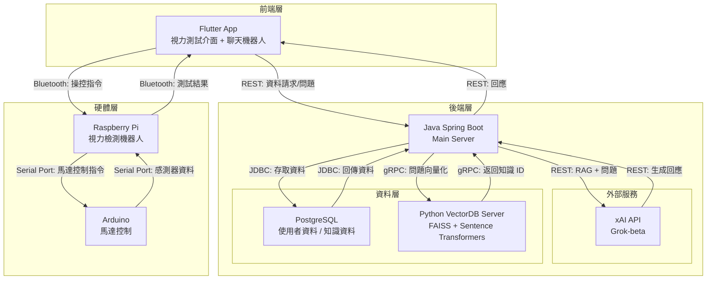

# 睛益求居 - 智能居家視力檢測小幫手

## 專案概述

「睛益求居」是一個智能居家視力檢測系統，結合硬體和軟體技術，提供便捷的視力檢測和眼科知識問答服務。系統透過 Raspberry Pi 和 Arduino 控制的機器人進行視力測試，結果回傳至 Flutter 手機應用程式，並上傳至 Spring Boot 後端儲存於 PostgreSQL 資料庫。應用程式內建聊天機器人，支援眼科問題查詢和衛教資訊，通過向量資料庫（VectorDB）和 xAI API 實現語義搜尋和智能回應。

### 核心功能
- **視力檢測**：由 Raspberry Pi 和 Arduino 控制的機器人執行視力測試，結果顯示於機器人螢幕與 Flutter 應用並上傳至後端。
- **聊天機器人**：Flutter 應用提供多語言聊天介面，回答眼科相關問題和衛教資訊。
- **資料管理**：PostgreSQL 儲存使用者資料和知識庫，向量資料庫（VectorDB）支援語義搜尋。
- **RAG 流程**：Spring 查詢 VectorDB 得到知識點 ID ，接下來從 ：PostgreSQL 找到對應的知識點後結合用戶資訊使用 xAI API 生成回應。

## 全端架構圖

以下是系統的架構圖，展示各組件間的交互流程：



## 組件概述

專案包含以下主要組件，每個組件有其專屬的 `README.md` 提供詳細說明：

1. **[Rpi](./Rpi/README.md)**  
   - **功能**：控制視力檢測機器人，支援語音交互、藍牙連線和 OLED 顯示，執行視力測試流程。  
   - **技術棧**：Python、RPi.GPIO、語音處理庫、藍牙庫。  
   - **用途**：處理硬體交互，將測試結果傳送至 Spring 後端。

2. **[Arduino](./Arduino/README.md)**  
   - **功能**：根據 Rpi 透過 Serial Port 傳送過來的資訊控制馬達，與 Rpi 協同進行視力測試。  
   - **技術棧**：Arduino C++、感測器庫。  
   - **用途**：執行底盤硬體控制任務。

3. **[App](./App/README.md)**  
   - **功能**：手機前端應用，提供視力測試介面和聊天機器人功能。  
   - **技術棧**：Dart、Flutter。  
   - **用途**：與使用者交互，顯示測試結果並發送問題至後端。

4. **[Backend](./Backend/README.md)**  
   - **功能**：主後端服務，處理 Flutter 請求、存取 PostgreSQL、與 VectorDB 和 xAI API 整合。  
   - **技術棧**：Java、Spring Boot、Maven、PostgreSQL。  
   - **用途**：協調資料流，管理視力檢測結果和聊天機器人回應。

5. **[Backend/VectorDB](./Backend/VectorDB/README.md)**  
   - **功能**：向量資料庫服務，使用 FAISS 和 Sentence Transformers 提供語義搜尋。  
   - **技術棧**：Python、gRPC、FAISS、Sentence Transformers。  
   - **用途**：檢索眼科知識，回傳知識 ID 與關聯度給 Spring 後端。

## 設置與運行

### 前置條件
- **硬體**：Raspberry Pi 3B+、Arduino Uno、穩定的網路連線。
- **軟體**：
  - Python 3.11+（Rpi、VectorDB）
  - Java 21+（Spring）
  - Flutter SDK（Flutter）
  - Arduino IDE（Arduino）
  - PostgreSQL 16+（資料庫）
- **外部服務**：xAI API 金鑰（參見 [xAI API 文件](https://x.ai/api)）。

### 安裝步驟
1. **複製專案**：
   ```bash
   git clone <repository-url>
   cd 2025-Medical-System-Project
   ```

2. **設置各組件**：
   - 參考各組件的 `README.md` 文件，安裝依賴並配置環境。

3. **啟動服務**：
   - **Rpi**：運行 `Rpi/src/main.py`。
   - **Backend**：運行 `docker-compose up -d`
   - **Flutter**：運行 `flutter run`。
   - **Arduino**：燒錄程式碼至設備（參見 `Arduino/README.md`）。

## 注意事項
- 確保各組件的配置文件（例如 `Rpi/config.json`、`Spring 的 application.yml`）正確設置。
- xAI API 使用需遵守配額限制，詳見 [xAI API 文件](https://docs.x.ai/docs/overview)。
- 硬體組件（Rpi、Arduino）的 GPIO 或序列埠配置需與程式碼一致
- 專案路徑請勿包含中文、空格、特殊字元等

## 聯繫與支援
如有問題或需要擴展功能（例如新增 API 端點、優化硬體交互），請聯繫專案維護者或提交 issue 至版本控制庫。

## 授權
本專案採用 [GNU General Public License v3.0](./LICENSE)，詳情請見授權文件。