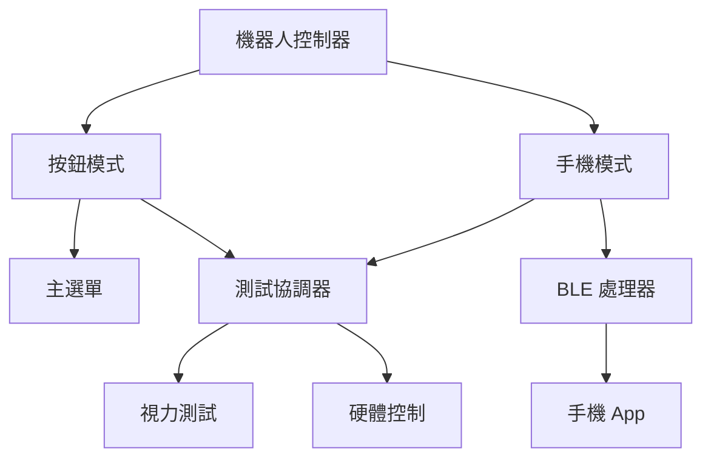
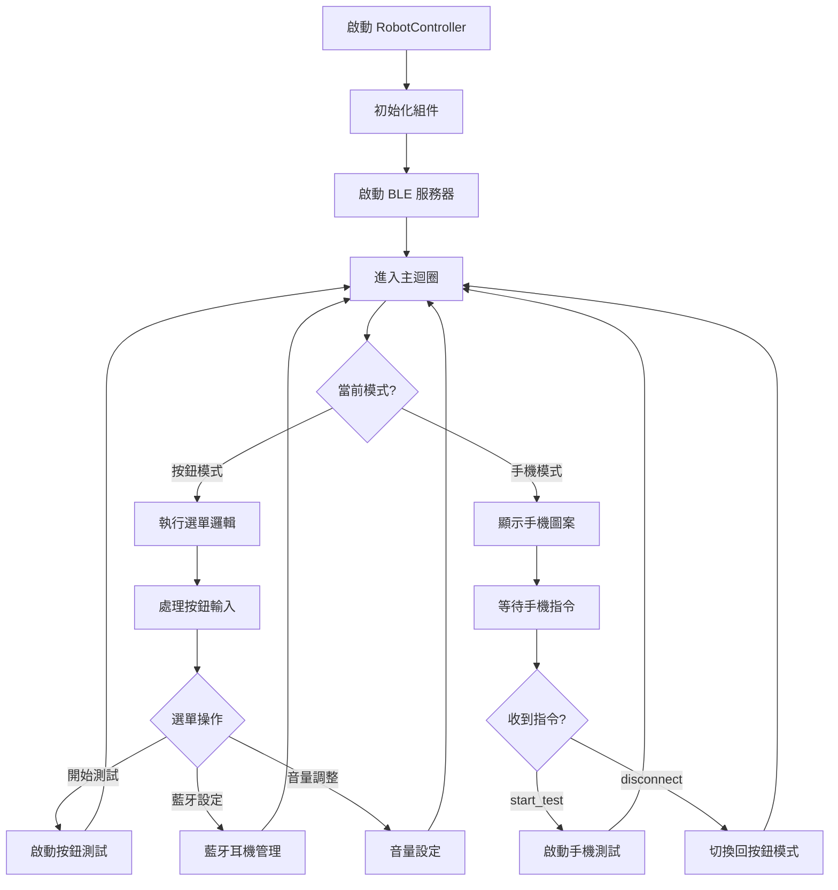
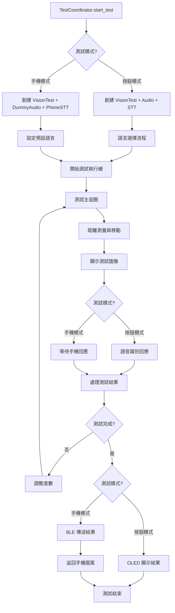

# Raspberry Pi 視力檢測機器人組件

## 概述
本組件運行於 Raspberry Pi，負責控制視力檢測機器人，支援雙操作模式：
- **板載按鈕模式**：透過實體按鈕進行選單操作和測試
- **手機控制模式**：透過 BLE 連接手機 App 進行遠端控制

主要功能包括語音交互（錄製與播放）、藍牙耳機連線、OLED 顯示、按鈕輸入和自動馬達控制。測試結果可透過藍牙傳送至 Flutter App，再由手機透過網路傳送至後端系統。

## 硬體需求
- Raspberry Pi 3B+ 或以上
- OLED 顯示器（128x64，I2C 地址 0x3c）
- 3個按鈕（上/確認/下：GPIO 16/20/21）
- 超音波感測器（Trigger: GPIO 23, Echo: GPIO 24）
- 馬達控制模組（UART 通訊）

## 軟體依賴
- Python 3.11+
- 主要套件（詳見 `requirements.txt`）：
  - `RPi.GPIO`：硬體控制
  - `PyAudio`、`webrtcvad`：語音處理
  - `dbus-fast`：藍牙 BLE 通訊
  - `Adafruit-SSD1306`：OLED 控制
  - `pulsectl`：音訊系統管理

## 檔案結構
```

## 系統架構


Rpi/
├── src/
│   ├── audio/                    # 音訊處理（錄製、播放、語音識別）
│   ├── ble_communication/        # BLE 服務器
│   ├── bluetooth_headset/        # 藍牙耳機管理
│   ├── data/                     # 視力測試參數和圖形繪製
│   ├── hardwares/               # 硬體控制（按鈕、馬達、OLED、感測器）
│   ├── rpi/                     # 核心邏輯（選單、測試流程、資源管理）
│   ├── main.py                  # 程式入口
│   ├── robot_controller.py      # 主控制器
│   ├── phone_handler.py         # 手機通訊處理
│   └── test_coordinator.py      # 測試協調器
├── config.json                  # 配置檔案
├── requirements.txt             # 依賴清單
├── settings.py                  # 系統設置
└── startup.sh                   # 啟動腳本
```

## 設置與運行

### 1. 安裝依賴
```bash
pip install -r requirements.txt
```

### 2. 配置硬體
- 連接到 GPIO 腳位的設備（麥克風、揚聲器、OLED、按鈕等）需符合 `settings.py` 的設置
- 啟用 I2C 和 UART：`sudo raspi-config`
- 配置藍牙連線（參見 `src/bluetooth_headset/device_manager.py`）

### 3. 運行程式
```bash
# 推薦使用啟動腳本
./startup.sh
```

## 操作模式

### 板載按鈕模式
- **主選單**：開始測試 / 藍牙設定 / 音量調整
- **測試流程**：語言選擇 → 自動測試 → OLED 顯示結果

### 手機控制模式  
- **BLE 服務**：EyeDwell (`12345678-abcd-1234-5678-123456789abc`)
- **手機指令**：connect/disconnect、start_test、direction_response
- **測試流程**：自動測試（無音檔播放）→ 結果傳送至手機

## 功能表（Menu）
|            | MENU_STATE_ROOT | MENU_STATE_BT | MENU_STATE_VOLUME |
|------------|-----------------|---------------|-------------------|
| no device  | root, ind=1     | bt, kp ind    | root, ind=1       |
| has device | root, kp ind    | bt, kp ind    | volume, kp ind    |

## 流程圖

### 主控制器流程


### 測試協調器流程


## 視力測試流程

1. **初始化**：測量距離、語言設定（按鈕模式）
2. **動態定位**：根據度數自動移動到目標距離
3. **顯示測試**：顯示 Landolt C 視標，等待方向回應
4. **結果處理**：按鈕模式顯示於 OLED，手機模式透過 BLE 傳送

測試度數範圍：0.1 - 1.5，起始度數：0.5

## BLE 通訊協議

### 指令格式 (手機 → 機器人)
```json
{"type": "connect"}                              // 進入手機模式
{"type": "start_test"}                          // 開始測試
{"type": "direction_response", "direction": 2}  // 方向回應 (0=右,1=上,2=左,3=下)
{"type": "stt_response", "text": "texts"}       // STT結果回應
{"type": "disconnect"}                          // 回到按鈕模式
```

### 資料格式 (機器人 → 手機)
```json
{"type": "ready_for_input"}                     // 準備接收輸入
{"type": "test_complete", "score": 1.2}        // 測試完成
```

## 注意事項
- 確保 GPIO 腳位配置正確
- 語音檔案需放置於 `src/audio/audioFiles/` 對應語言資料夾
- 藍牙連線需穩定，避免測試中斷
- 手機模式下 OLED 僅顯示手機圖案，不播放音檔