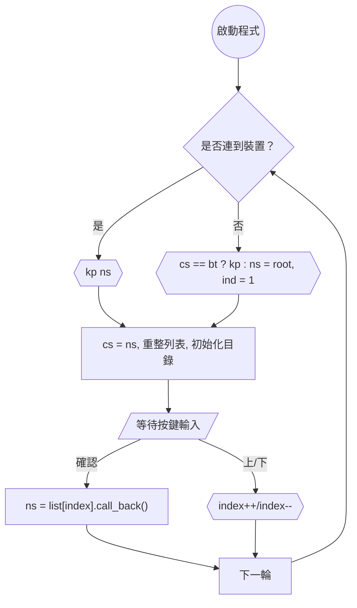
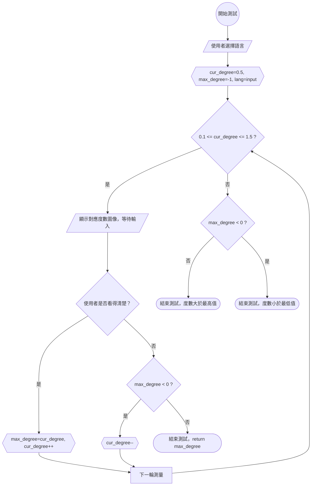

# Raspberry Pi 組件

## 概述
本組件運行於 Raspberry Pi，負責控制視力檢測機器人，支援語音交互（錄製與播放）、藍牙連線、OLED 顯示和按鈕輸入，支援選單連線藍芽耳機，利用藍芽耳機做視力檢測，也可連線手機App，將視力測試結果通過藍牙傳送至 Flutter App，再由手機 透過網路傳送至 Spring 後端，儲存於 PostgreSQL 資料庫。

## 硬體需求
- Raspberry Pi 3B+ 或 以上
- OLED 顯示器（顯示視力測試圖像）
- 按鈕（選單操作）
- 超音波感測器
- 馬達

## 軟體依賴
- Python 3.11+
- 必要庫（見 `requirements.txt`）：
  - `RPi.GPIO`：硬體控制
  - `speech_recognition`、`pyaudio`：語音處理
  - `pybluez`：藍牙連線

## 檔案結構
```
Rpi/
├── src/                          # 程式碼
│   ├── audio/                    # 音訊模組
│   │   ├── models.py             # 音訊相關類
│   │   ├── detection.py          # 語言檢測
│   │   ├── player.py             # 音訊播放
│   │   ├── recorder.py           # 音訊錄製
│   ├── bluetooth/                 # 藍牙模組
│   │   ├── models.py             # 藍牙相關類
│   │   ├── manager.py            # 藍牙設備管理
│   ├── data/                     # 靜態資料
│   │   ├── draw.py               # 圖像繪製
│   │   ├── vision.py             # 視力測試邏輯
│   │   ├── NotoSansCJK-Regular.ttc # 字型檔案
│   ├── hardwares/                # 硬體控制
│   │   ├── motor.py              # 馬達控制（與 Arduino 交互）
│   │   ├── oled.py               # OLED 顯示
│   │   ├── sonic.py              # 超音波感測器
│   │   ├── button.py             # 按鈕輸入
│   ├── rpi/                      # 樹莓派邏輯
│   │   ├── models/               # 模型定義
│   │   │   ├── menus.py          # 選單模型
│   │   │   ├── testers.py        # 測試模型
│   │   ├── interrupt.py          # 中斷處理
│   │   ├── menu.py               # 選單邏輯
│   │   ├── resource.py           # 資源管理
│   │   ├── tester.py             # 測試邏輯
│   ├── config/                    # 配置模組
│   │   ├── manager.py            # 配置管理
│   ├── main.py                   # 程式入口
├── tests/                        # 測試
│   ├── unit/                     # 單元測試
│   ├── integration/              # 整合測試
├── config.json                   # 配置檔案
├── requirements.txt              # 依賴清單
├── settings.py                   # 系統設置
├── README.md                     # 本文件
```

## 設置與運行
1. **安裝依賴**：
   ```bash
   pip install -r requirements.txt
   ```

2. **配置硬體**：
   - 連接到 GPIO 腳位的設備（麥克風、揚聲器、OLED、按鈕等）需符合 `config.json` 的設置。
   - 配置藍牙連線（參見 `src/bluetooth/manager.py`）。

3. **運行程式**：
   ```bash
   python src/main.py
   ```

## 功能表（Menu）
|            | MENU_STATE_ROOT | MENU_STATE_BT | MENU_STATE_VOLUME |
|------------|-----------------|---------------|-------------------|
| no device  | root, ind=1     | bt, kp ind    | root, ind=1       |
| has device | root, kp ind    | bt, kp ind    | volume, kp ind    |

## 流程圖
### 主流程


### 視力測試流程


## 注意事項
- 確保 GPIO 腳位與 `config.json` 配置一致。
- 語音檔案（`src/audio/audioFiles/`）需支援多語言（en、jp、tw、zh）。
- 藍牙連線需穩定，避免中斷影響測試過程或手機連線。
- 視力測試需確保 OLED 顯示器正常運作，測試結果通過藍牙或網路傳至 Spring 後端。